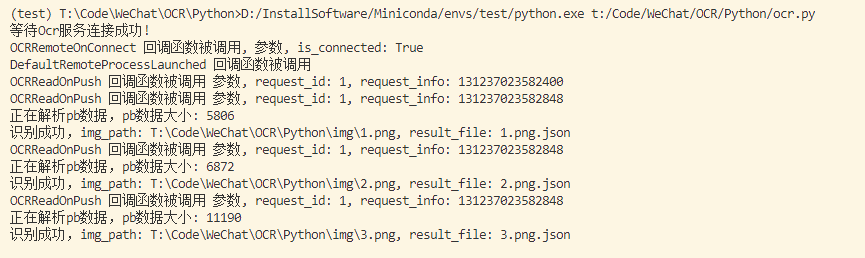

## 项目说明
本项目是使用Python来调用微信本地ocr模型，调用方法完全由[QQImpl](https://github.com/EEEEhex/QQImpl)翻译过来。也就是说该项目只是将原C++代码翻译成了纯Python实现。

#### 温馨提示

该项目自己玩玩就行，不要用于商业用途

## 使用说明

#### 安装
`pip install wechat-ocr`

#### 依赖(必要条件)

1. 能运行最新版微信的Windows系统
2. 已经安装最新版微信
3. Python环境，版本任意

#### 示例
```python
import os
import json
import time
from wechat_ocr.ocr_manager import OcrManager, OCR_MAX_TASK_ID


wechat_ocr_dir = "C:\\Users\\Administrator\\AppData\\Roaming\\Tencent\\WeChat\\XPlugin\\Plugins\\WeChatOCR\\7057\\extracted\\WeChatOCR.exe"
wechat_dir = "D:\\GreenSoftware\\WeChat\\3.9.6.32"

def ocr_result_callback(img_path:str, results:dict):
    result_file = os.path.basename(img_path) + ".json"
    print(f"识别成功，img_path: {img_path}, result_file: {result_file}")
    with open(result_file, 'w', encoding='utf-8') as f:
       f.write(json.dumps(results, ensure_ascii=False, indent=2))

def main():
    ocr_manager = OcrManager(wechat_dir)
    # 设置WeChatOcr目录
    ocr_manager.SetExePath(wechat_ocr_dir)
    # 设置微信所在路径
    ocr_manager.SetUsrLibDir(wechat_dir)
    # 设置ocr识别结果的回调函数
    ocr_manager.SetOcrResultCallback(ocr_result_callback)
    # 启动ocr服务
    ocr_manager.StartWeChatOCR()
    # 开始识别图片
    ocr_manager.DoOCRTask(r"T:\Code\WeChat\OCR\Python\img\1.png")
    ocr_manager.DoOCRTask(r"T:\Code\WeChat\OCR\Python\img\2.png")
    ocr_manager.DoOCRTask(r"T:\Code\WeChat\OCR\Python\img\3.png")
    time.sleep(1)
    while ocr_manager.m_task_id.qsize() != OCR_MAX_TASK_ID:
        pass
    # 识别输出结果
    ocr_manager.KillWeChatOCR()
    

if __name__ == "__main__":
    main()
```

#### 运行结果



## 感谢

https://github.com/EEEEhex/QQImpl